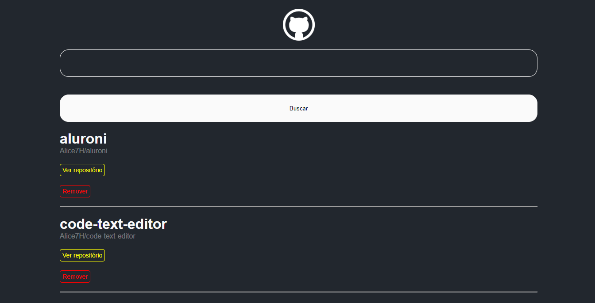

<h1 align="center">
  
</h1>

# GitHub Wiki

Neste projeto, criamos uma Wiki para salvar alguns repositórios. Para isso, usamos o consumo da API do GitHub para listar os conjuntos de interesse.

Para utilizar a aplicação, basta inserir no campo de busca, o nome do usuário e o nome do repositório.
Ex: `nome-do-usuario/nome-do-projeto`

## Tarefas e modificações

- Implementação da funcionalidade de remover o repositório da lista.
- Mudanças na estilização da lista de repositórios.
- Troca de tag `a` por `button`, por questões semânticas
- Remoção da altura no `Container` da página App.
